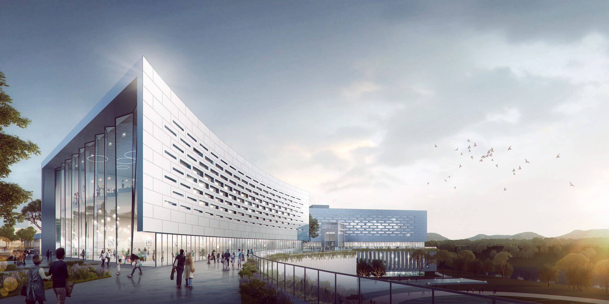

<!--
保持本文档简短明了，
链接到外部资源，而不是包含内联内容。
请参阅“release/text/readme.html”了解最终用户自述文件。
-->

ALD3D
=======

ALD3D® 软件可生成专业品质的三维动画、渲染和模型。这是一款高效、灵活的工具组合，可帮助您在更短的时间内创建更好的三维内容.

Project Pages
-------------

- [一千零一亿官网](https://www.art1001.online/)
- [参考手册](https://docs.ALD3D.org/manual/en/latest/index.html)
- [用户社区](https://www.ALD3D.org/community/)

产品特性
-------

- **润饰**  
为照片级真实图像提供材质、照明和纹理等细节点缀.

- **导入功能**
从任意位置导入数据，以便直接使用 CAD 和 BIM 数据或增强三维设计的细节.

- **基于物理的照明**
模拟人造光源以准确描述灯光和阴影将如何与设计交互.

- **从技术到视觉的转变**
丰富而强大的工具组合使您可以通过艺术控制对高级建筑设计进行建模.

- **交互式渲染**
工作时，在渲染帧窗口中查看和更改接近最终渲染质量的场景.

- **高质量图像**
高级工具为您提供了内置的渲染功能，用于创建更高质量的照片级可视化效果.

产品价值
-------
- 可完全替代传统3D软件

- 建模、动画、视频一体化3D

- 无需搜罗，丰富的插件功能内置

- 支持传统3D格式无缝导入

- 在线开放的建筑/装饰图库

- 打组功能

- 高效的阿拉丁3D云渲染

产品价值
-------
- **界面友好的自定义功能设计**  
完全自定义操作，高倍提升建模效率

- **强兼容性**  
兼容目前主流3D文件格式，包括3ds、skp、fbx、blender等

开发者
-----------

- [Build Instructions](https://developer.ALD3D.org/docs/handbook/building_ALD3D/)
- [Code Review & Bug Tracker](https://projects.ALD3D.org)
- [Developer Forum](https://devtalk.ALD3D.org)
- [Developer Documentation](https://developer.ALD3D.org/docs/)

许可证 （许可证？许可证是什么玩意 XD
-------

ALD3D 整体上不遵循 GNU 通用公共许可证第 3 版。
个别文件可能具有不同但兼容的许可证。

See [ALD3D.org/about/license](https://www.ALD3D.org/about/license) for details.
